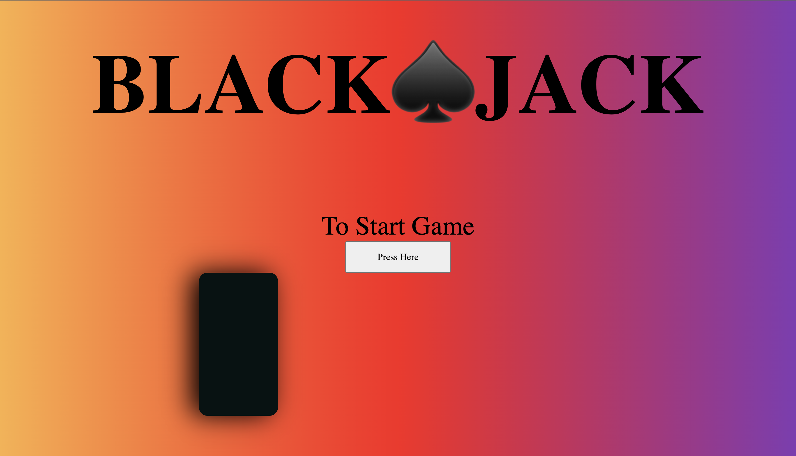
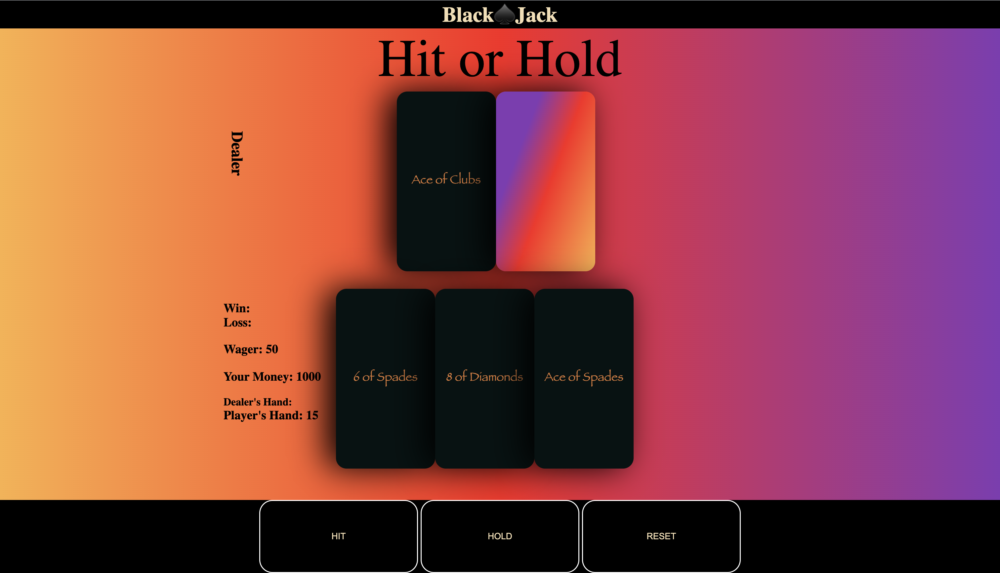

# Black Jack

### Date : Jan 20, 2022

### By: Tyler Coats
- [LinkedIn](www.linkedin.com/in/tylerccoats)
- [GitHub](https://github.com/TylersCoffeeCode)

## Objectives
  - Create a website application using html, css, and javascript to run BlackJack
  - Create a professional informative readme
  - Utilize flexbox/grid
  - Contain at least 2 event handlers, 20 git commits, and code should be properly indented with no unused/logged code

# Game Preview

# Instructions
Press "Press Here" to begin 
 Press "Hit" to try and get as close to 21 without going over
 Press "Hold" once your satisfied with your cards
 Then let the luck of the cards help or hinder you
 Wager more cash if you're feeling lucky
 Press Reset after game is over to get a new set of cards

### Resources
SFX provided by Epidemic Sounds
